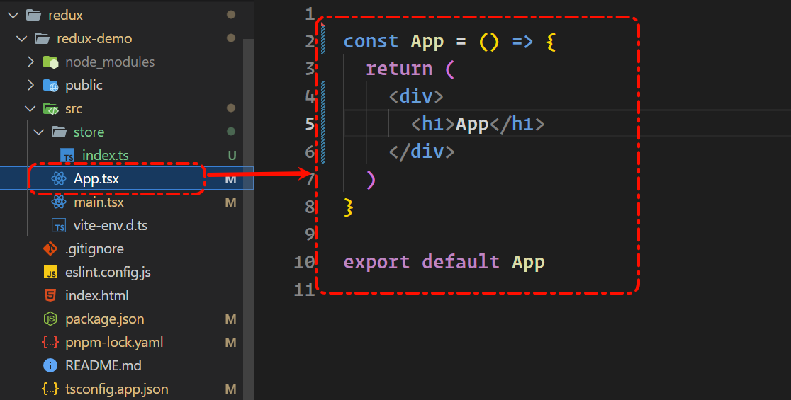
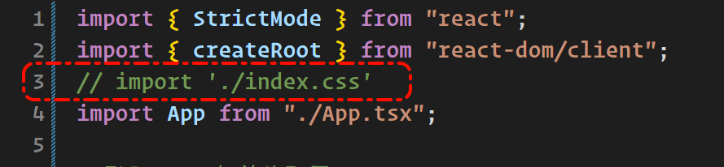
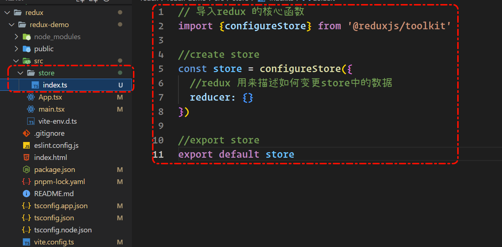
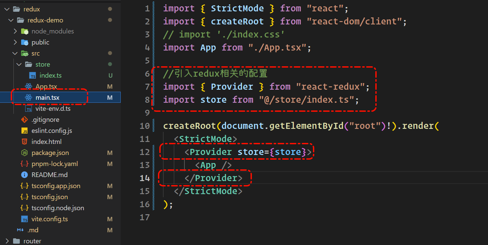
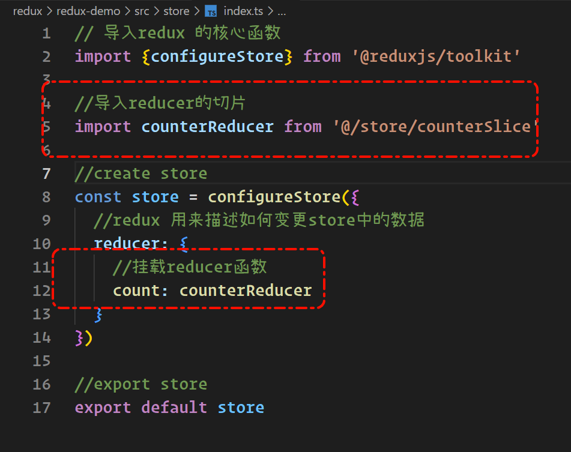

# 创建react项目

`pnpm create vite`
`cd 项目中`
`pnpm install`
`pnpm dev`

# 安装 redux 和配套的库

`pnpm add @reduxjs/toolkit react-redux`

# 初始化项目

#### 1. 删除不必要的文件和代码

把css的文件都删了

App.tsx变成



main.tsx变成



#### 配置文件

store/index.ts



main.tsx




# 创建一个counter切片
store/counterSlice.ts

```js
// 1. 导入 createSlice 函数，用来创建切片
import { createSlice } from '@reduxjs/toolkit'

// 2. 调用 createSlice 函数创建切片
// 必须提供 name, initialState, reducers 这三个配置选项
const counterSlice = createSlice({
  // 切片的唯一标识符
  name: 'counter',
  // 初始的 state 数据
  initialState: {
    value: 0
  },
  // reducers 函数，用来描述如何更新 state 数据
  reducers: {}
})

// 3. 向外默认导出当前 slice 切片生成的 reducer 函数
export default counterSlice.reducer
```

在index.ts中引入




#
#
