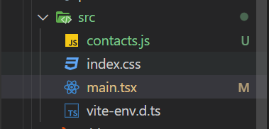

# 前端路由和后端路由的区分

前端路由和后端路由是Web开发中处理URL和页面导航的两种不同方式，它们各有特点，也有些共通之处。

**后端路由 (Backend Routing)**

-   **定义**: 当用户在浏览器中输入URL或点击链接时，请求首先发送到服务器。服务器根据请求的URL路径，决定调用哪个控制器(Controller)或处理函数(Handler)来处理这个请求，并生成相应的HTML页面（或其他响应，如JSON）返回给浏览器。

-   **执行环境**: 服务器端 (例如 Node.js, Python/Django, Java/Spring, Ruby/Rails, PHP/Laravel)。

-   **工作方式**:

    1.  浏览器发起HTTP请求（例如 GET /users/123）。
    1.  服务器接收请求。
    1.  服务器端的路由系统解析URL (/users/123)。
    1.  匹配到预定义的路由规则，执行相应的业务逻辑（如从数据库查询ID为123的用户信息）。
    1.  服务器将处理结果（通常是完整的HTML页面）返回给浏览器。
    1.  浏览器接收到HTML并渲染页面。

-   **特点**:

    -   每次页面切换（大部分情况下）都会向服务器发送新的请求，服务器返回全新的页面。
    -   SEO友好：搜索引擎爬虫可以直接抓取到完整的、包含内容的HTML页面。
    -   首屏加载速度相对较快（因为直接返回渲染好的HTML）。
    -   逻辑清晰，每个URL对应一个服务器端的处理单元。

**前端路由 (Frontend Routing)**

-   **定义**: 主要用于单页面应用 (SPA - Single Page Application)。当URL发生变化时（通常是通过JavaScript操作history API或hash），前端路由库会拦截这些变化，不向服务器发送新的页面请求，而是在客户端动态地加载和渲染对应的UI组件或视图。

-   **执行环境**: 浏览器端 (使用JavaScript，例如 React Router, Vue Router, Angular Router)。

-   **工作方式**:

    1.  首次加载时，浏览器请求一个主HTML文件（例如 index.html）和相关的JavaScript包。服务器通过后端路由返回这个主文件。
    1.  应用加载完成后，用户点击链接（例如 `<a href="/profile">`）或通过代码导航。
    1.  前端路由库捕获这个导航事件。
    1.  它会阻止浏览器的默认行为（即向服务器发送请求）。
    1.  根据新的URL路径 (/profile)，前端路由库在当前页面内动态地卸载旧组件，加载并渲染新组件。
    1.  URL会通过history.pushState()或hash改变，但浏览器不会重新加载整个页面。
    1.  如果需要数据，会通过AJAX/Fetch异步向后端API请求数据，然后更新视图。

-   **特点**:

    -   页面切换流畅，用户体验好，因为不需要重新加载整个页面。

    -   服务器压力小，因为大部分导航只在客户端完成，只在需要数据时才与服务器交互。

    -   首屏加载可能较慢，因为需要加载整个SPA的框架和代码。

    -   SEO相对不友好（除非使用SSR服务器端渲染或预渲染技术），因为初始HTML可能只是一个空壳。

    -   有两种主要模式：

        -   **Hash模式**: URL中带有 # (例如 `example.com/#/profile`)，#之后的内容变化不会触发浏览器向服务器发送请求。兼容性好。
        -   **History模式**: URL看起来像普通URL (例如 `example.com/profile`)，使用HTML5 History API (pushState, replaceState)。更美观，但需要服务器配置支持，否则刷新页面或直接访问子路径时会404（因为服务器上可能没有实际的 /profile 文件）。

**相同点 (Similarities)**

1.  **核心目标**: 都是为了管理和响应URL的变化，将用户导航到应用的不同部分或视图。
1.  **路径匹配**: 都需要定义路由规则（路径模式）来匹配URL，并决定执行什么操作或显示什么内容。
1.  **参数传递**: 都支持在URL中传递参数（例如 /users/:id 中的 id），并在路由处理逻辑中获取这些参数。
1.  **层级结构/嵌套**: 都可以实现嵌套路由，表示页面或组件之间的层级关系。
1.  **导航守卫/中间件**: 都可以实现类似导航守卫或中间件的功能，在路由跳转前或后执行特定逻辑（如权限验证、数据预取等）。

**主要区别 (Key Differences)**

| 特性        | 后端路由                | 前端路由                            |
| --------- | ------------------- | ------------------------------- |
| **执行位置**  | 服务器端                | 浏览器端 (客户端)                      |
| **页面刷新**  | 每次导航通常导致整个页面刷新      | 导航时页面不刷新，只更新部分内容（SPA核心）         |
| **服务器交互** | 每次导航都与服务器交互获取新页面    | 首次加载后，导航主要在客户端完成，仅数据交互时请求服务器    |
| **响应内容**  | 通常是完整的HTML页面        | 主要是更新DOM，渲染新的UI组件               |
| **URL感知** | 服务器直接处理浏览器地址栏的URL   | 监听浏览器地址栏URL变化（hash或history API） |
| **SEO**   | 较好，搜索引擎易于抓取         | 默认较差，需要SSR/预渲染等技术优化             |
| **用户体验**  | 切换时可能有白屏或延迟         | 切换流畅，接近原生应用体验                   |
| **首屏加载**  | 相对较快                | 可能较慢（需加载整个应用框架）                 |
| **适用场景**  | 传统多页面应用 (MPA)，内容型网站 | 单页面应用 (SPA)，交互复杂的应用             |

**总结**

在现代Web应用中，前端路由和后端路由往往是**协同工作**的：

-   **后端路由**负责API接口的路由（提供数据）和SPA应用初始HTML骨架的加载。
-   **前端路由**负责SPA应用内部的视图切换和用户导航。

例如，用户首次访问 www.example.com，后端路由返回 index.html 和SPA的JavaScript包。之后用户点击应用内的链接，如导航到 /dashboard，前端路由接管，URL变为 www.example.com/dashboard（如果是History模式），但浏览器不刷新，前端JS动态渲染出Dashboard视图，并可能通过AJAX向后端API /api/dashboard-data (由后端路由处理) 请求数据。如果用户此时刷新 www.example.com/dashboard，服务器需要配置成对于所有前端路由路径都返回 index.html，以便前端路由能够再次接管。

#### 

router 路由器

route 路线

# 创建react typescript 的项目

#### 安装工具
  安装 `npm install -g pnpm@latest-10`

#### 创建react typescript的项目
1. 安装react
`pnpm create vite 项目名称 --template react-ts`

2. 下载资源
`pnpm install`

3. 运行项目
`pnpm run dev`

4. 安装路由库

`pnpm add react-router-dom`

5. 安装项目中要学习需要安装的库，不是必须的

`pnpm add localforage match-sorter sort-by`

# 在项目中使用 router

在main中使用 




```js
import { StrictMode } from "react";
import { createRoot } from "react-dom/client";
import "./index.css";

//引入
import { RouterProvider, createBrowserRouter } from "react-router-dom";

//创建路由对象
const router = createBrowserRouter([
  {
    path: "/",
    element: <h1>wei and gao</h1>,
  },
]);

createRoot(document.getElementById("root")!).render(
  <StrictMode>
    {/* 配置和使用路由对象 */}
    <RouterProvider router={router} />
  </StrictMode>
);

```

#