# 创建react typescript 的项目

#### 安装工具
  安装 `npm install -g pnpm@latest-10`

#### 创建react typescript的项目
1. 安装react
`pnpm create vite 项目名称 --template react-ts`

2. 下载资源
`pnpm install`

3. 运行项目
`pnpm run dev`

#### pnpm 常用的命令
| 操作     | npm                     | pnpm                 |
| ------ | ----------------------- | -------------------- |
| 安装依赖   | `npm install`           | `pnpm install`       |
| 添加依赖   | `npm install axios`     | `pnpm add axios`     |
| 添加开发依赖 | `npm install -D eslint` | `pnpm add -D eslint` |
| 删除依赖   | `npm uninstall axios`   | `pnpm remove axios`  |
| 运行脚本   | `npm run dev`           | `pnpm dev`           |

# 创建zustand的基本使用环境

#### 安装zustand `pnpm add zustand`

#### 配置 @ 路径别名

**主要需要修改两个文件**

1.  vite.config.ts：让 Vite 在构建和开发时能够解析这些别名。
2.  tsconfig.json：让 TypeScript 编译器和你的 IDE (如 VS Code) 能够理解这些别名，提供正确的类型检查和路径提示。
3.  tsconfig.app.json 添加一行代码即可

**vite.config.ts**

```bash
# 使用 npm
npm install -D @types/node

# 或者使用 yarn
yarn add -D @types/node

# 或者使用 pnpm
pnpm add -D @types/node
```

```js
import { defineConfig } from 'vite'
import react from '@vitejs/plugin-react'
//import path
import path from 'path'

// https://vite.dev/config/
export default defineConfig({
  plugins: [react()],
  resolve: {
    alias: {
      '@': path.resolve(__dirname, './src')
    }
  }
})
```

**tsconfig.json**


```js
{
  "files": [],
  "references": [
    { "path": "./tsconfig.app.json" },
    { "path": "./tsconfig.node.json" }
  ],
  "compilerOptions": { // 这些选项会被 tsconfig.app.json 继承
    "baseUrl": ".",
    "paths": {
      "@/*": ["src/*"]
    }
  }
}
```

**tsconfig.app.json**

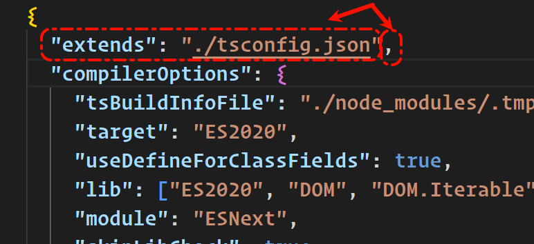

```js
{
  //添加 这一行即可
  "extends": "./tsconfig.json",

  "compilerOptions": {
    "tsBuildInfoFile": "./node_modules/.tmp/tsconfig.app.tsbuildinfo",
    "target": "ES2020",
    "useDefineForClassFields": true,
    "lib": ["ES2020", "DOM", "DOM.Iterable"],
    "module": "ESNext",
    "skipLibCheck": true,
    .....
  }}
```

# 使用zustand做一个简单的案例

在src目录下创建 `store/index.ts`  `components/Home.tsx`

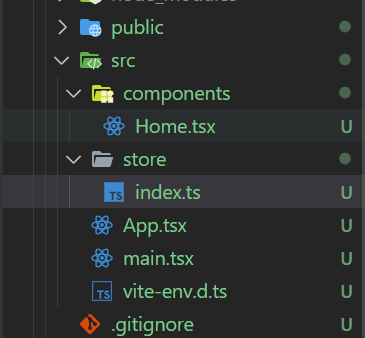

**index.ts**
```js
//导入zustand的create 函数
import {create} from 'zustand'

//使用create函数创建useStore 的 Hook
const useStore = create(()=> {
  //return 中可以存放全局共享的 数据 和 方法
  return {
    bears: 9
  }
})

//导出useStore
export default useStore
```

**Home.tsx**
```js
//引入useStore
import useStore from '@/store/index.ts'

const Home = () => {
  //在需要的组件中 调用useStore
  const bears = useStore(state=> state.bears)
  return (
    <div>
      <h1>bears counte is : {bears}</h1>
    </div>
  )
}

export default Home
```

# 添加类型提示在 vite-env.d.ts

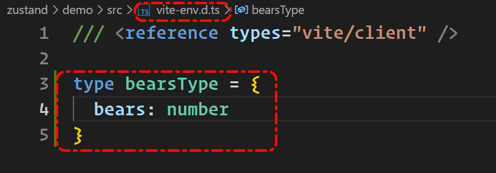

在index.ts中使用

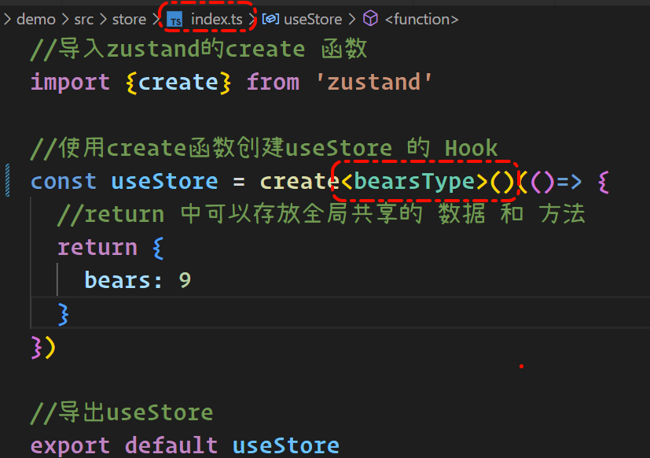

泛型后面多添加一个小括号是官方建议的

# 使用方法修改在index创建的值

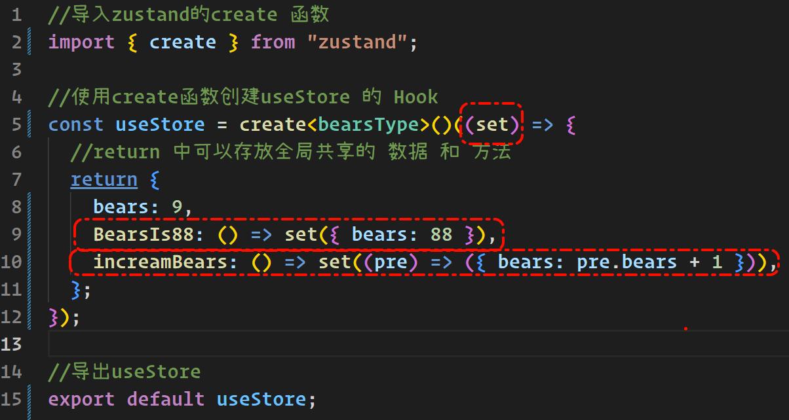

在create的函数中传入**set**参数
第一个方法是直接修改bears的值 返回对象覆盖原型的 完成bears的修改
第二个方法是调用之前的值修改bears的值  返回对象覆盖原型的 完成bears的修改

index.ts
```js
//导入zustand的create 函数
import { create } from "zustand";

//使用create函数创建useStore 的 Hook
const useStore = create<bearsType>()((set) => {
  //return 中可以存放全局共享的 数据 和 方法
  return {
    bears: 9,
    BearsIs88: () => set({ bears: 88 }),
    incrementBears: () => set((pre) => ({ bears: pre.bears + 1 })),
    resetBears: () => set({bears: 9})
  };
});

//导出useStore
export default useStore;
```
Home.tsx
```js
//引入useStore
import useStore from "@/store/index.ts";

const Home = () => {
  //在需要的组件中 调用useStore
  const bears = useStore((state) => state.bears);

  const BearsIs88 = useStore((state) => state.BearsIs88);
  const incrementBears = useStore((state) => state.incrementBears);
  const resetBears = useStore((state) => state.resetBears);
  return (
    <div>
      <h1>bears counte is : {bears}</h1>
      <div>
        <button onClick={BearsIs88}>bears is 88</button>
      </div>
      <div>
        <button onClick={incrementBears}>increment</button>
      </div>
      <div>
        <button onClick={resetBears}>reset bears</button>
      </div>
    </div>
  );
};

export default Home;

```

不要忘了在 `vite-env.d.ts` 中添加相应的ts代码
```js
/// <reference types="vite/client" />

type bearsType = {
  bears: number;
  BearsIs88: () => void;
  incrementBears: () => void;
  resetBears: () => void;
};

```
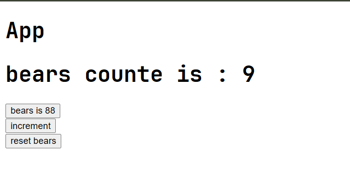

# 根据step相对应的修改bears的数量

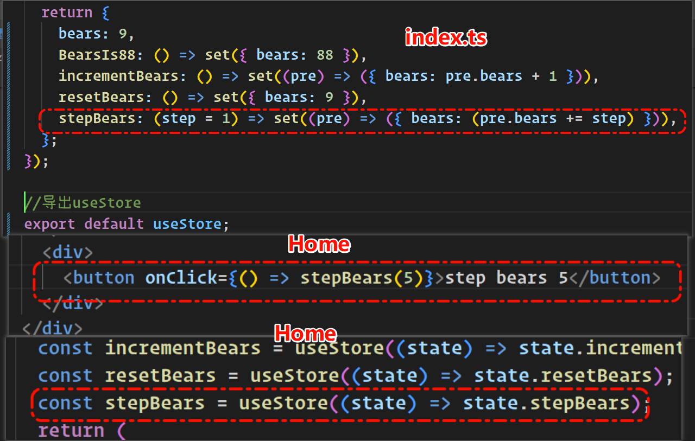

在vite-env.d.ts 特别注意
stepBears: (step?) => void


# 使用 get 延迟增加bears的数量

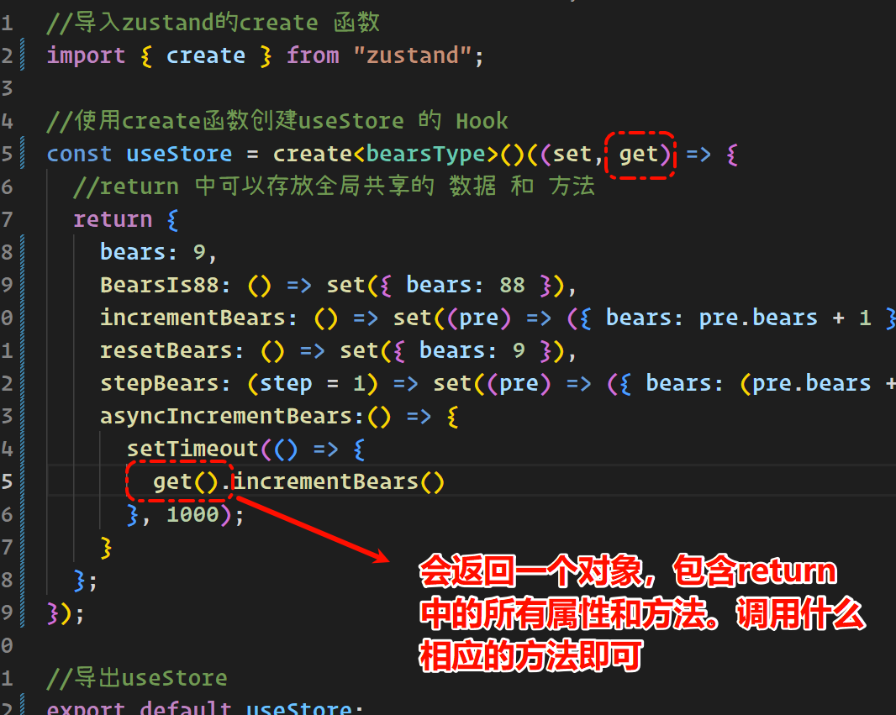

在index中get()会返回return中的属性和方法

通过setTimeout函数进行延迟操作即可

不要忘了在 `vite-env.d.ts` 中写对象的代码

在Home中引入和使用即可


# 作业--使用fish变量  安装上面的

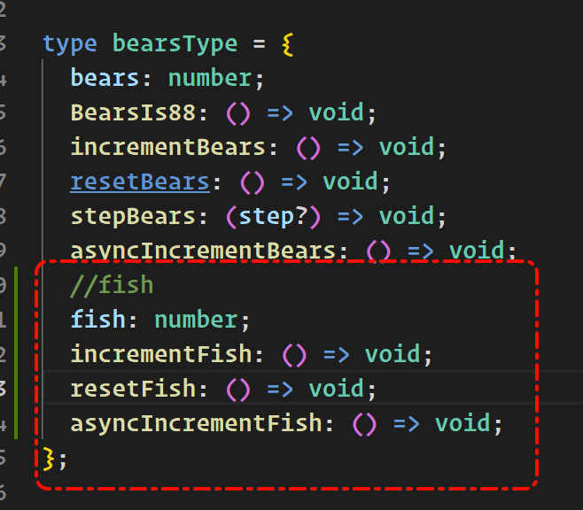
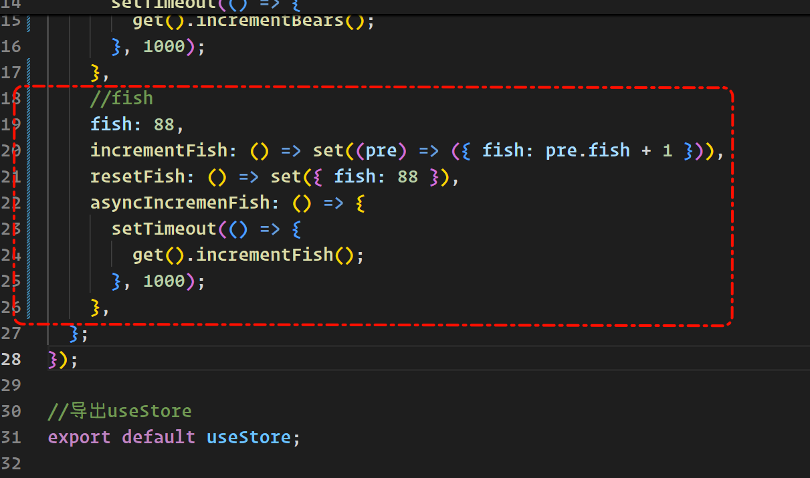
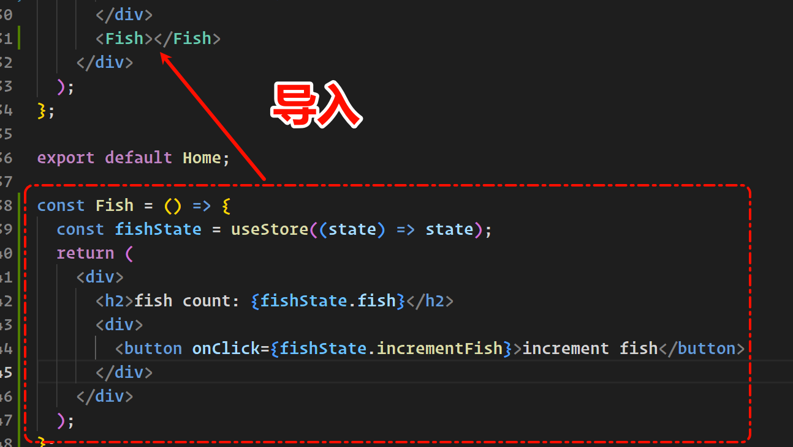

###### 优化 
在Home中 `const fishstate = usestore((state) => state);`,不返回具体的属性和方法了。直接返回state对象

在下面中使用`对象.属性|方法`


# 拆分store  还没有写完
#### 选择哪种方法？

-   **多个独立 Store**：

    -   当你的应用程序的不同部分确实是高度解耦的，并且它们之间几乎没有或很少有交互时。
    -   当你希望最大限度地减少任何一个更新可能导致的（即使是微小的）检查开销时（尽管 Zustand 和 React 已经非常高效）。
    -   团队分工明确，不同团队负责不同的 store。

-   **组合 Slices 到单个 Store**：

    -   当你的应用程序状态虽然可以按功能划分，但这些部分之间仍有合理的交互和依赖时。
    -   当你希望提供一个统一的 API（单个 hook）来访问所有状态时。
    -   当你希望在 action 中方便地 get() store 的其他部分的状态时。
    -   这是更常见的模式，因为它在组织性和便利性之间取得了很好的平衡。

#### 拆分 bears  fish  

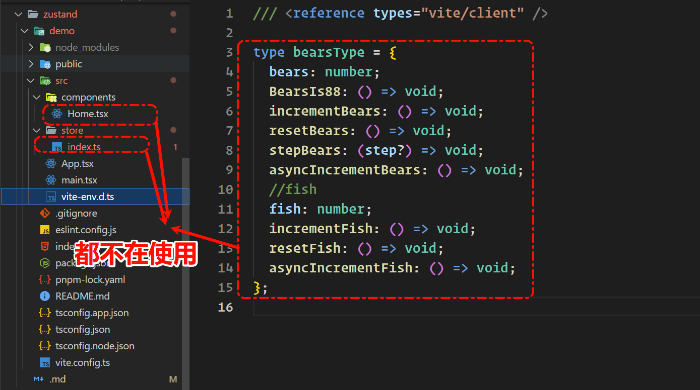

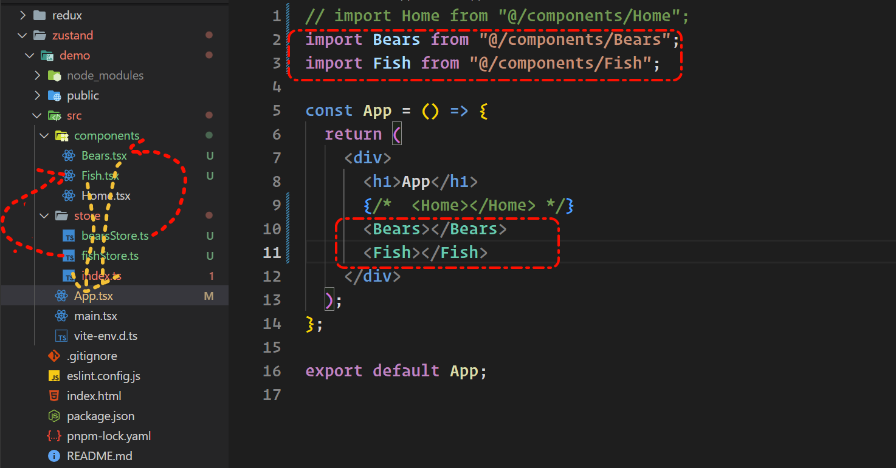


# 使用zustand/middleware 的 persist 对数据进行持久化

bearsStore.ts
```js
//导入zustand的create 函数
import type { bearsUseStoreType } from "@/vite-env";
import { create } from "zustand";
import {persist, createJSONStorage} from 'zustand/middleware'

//使用create函数创建useStore 的 Hook
const bearsUseStore = create<bearsUseStoreType>()(persist((set, get) => {
  //return 中可以存放全局共享的 数据 和 方法
  return {
    bears: 9,
    BearsIs88: () => set({ bears: 88 }),
    incrementBears: () => set((pre) => ({ bears: pre.bears + 1 })),
    resetBears: () => set({ bears: 9 }),
    stepBears: (step = 1) => set((pre) => ({ bears: (pre.bears += step) })),
    asyncIncrementBears: () => {
      setTimeout(() => {
        get().incrementBears();
      }, 1000);
    },
  };
}, {
  name: 'bears-storage',
  //默认为 localStorage
  storage: createJSONStorage(()=> localStorage)
}));

//导出useStore
export default bearsUseStore;

```

fishStore.ts
```js
//导入zustand的create 函数
import { create } from "zustand";
import type { fishUseStoreType } from "@/vite-env";
import { persist, createJSONStorage } from "zustand/middleware";

//使用create函数创建useStore 的 Hook
const fishUseStore = create<fishUseStoreType>()(
  persist(
    (set, get) => {
      //return 中可以存放全局共享的 数据 和 方法
      return {
        fish: 88,
        incrementFish: () => set((pre) => ({ fish: pre.fish + 1 })),
        resetFish: () => set({ fish: 88 }),
        asyncIncrementFish: () => {
          setTimeout(() => {
            get().incrementFish();
          }, 1000);
        },
      };
    },
    {
      name: "fish-session",
      storage: createJSONStorage(() => sessionStorage),
    }
  )
);

//导出useStore
export default fishUseStore;

```
**查看**
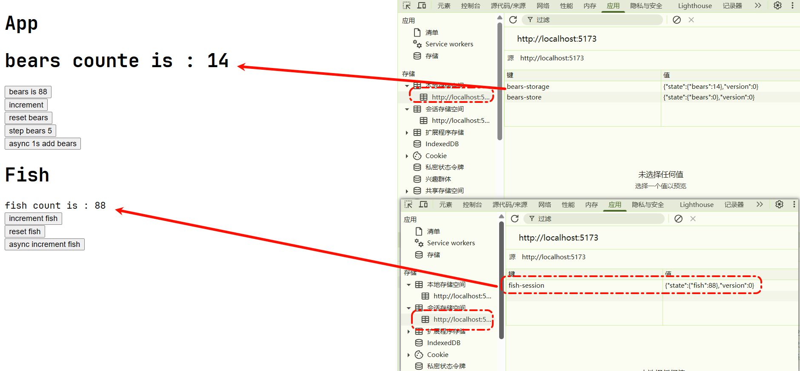


#


